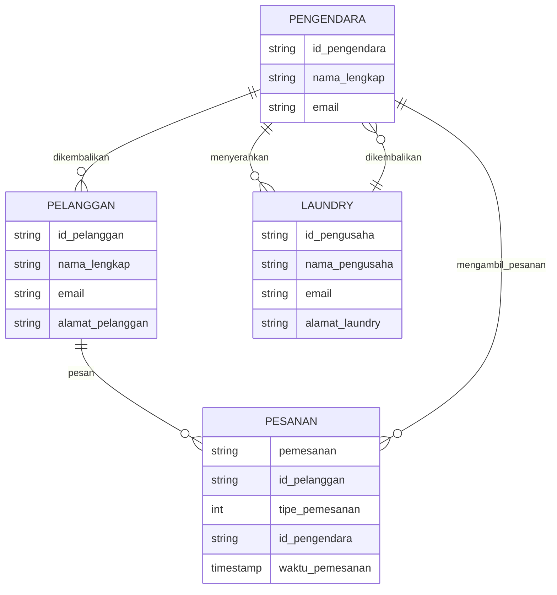

## 1.1 Latar Belakang

Di masa modern ini kita sebagai manusia sudah semakin terbiasa dengan gaya hidup praktis dan cepat, gaya hidup ini tercermin dari berbagai pilihan yang kita lakukan. Seperti belanja melalui E-commerce, memesan makanan melalui aplikasi online, bahkan tersedia juga aplikasi ojek online (Ex: GoJek, Grab, Maxim, Uber, dll) yang di aplikasi tersebut ada fitur yang memungkinkan kita untuk
melakukan kegiatan pembelian, transaksi, dan penjualan dari rumah. Tanpa harus bertatap muka (Ex: belanja bulanan, pembayaran E-commerce, pembelian/penjualan makanan, dll).

Salah satu contoh dari gaya hidup modern yang praktis dan cepat ini adalah cara kita mencuci pakaian, yang awalnya bermula dengan enggunakan tangan kita, lalu diciptakannya mesin cuci yang sangatb memudahkan kita dalam proses mencuci baju. Sampai pada akhirnya terciptalah bisnis Laundry, dimana bisnis Laundry ini menawarkan jasa pencucian dan penyetrikaan baju. Jadi kita tidak usah pusing
mencuci dan menyetrika baju kita sendiri, karena sekarang dengan menggunakan bisnis Laundry ini kita cukup membayar biaya yang diperlukan untuk jasa mereka dan bisa tenang tentang urusan mencuci baju dan menyetrikanya.

Bisnis Laundry di Indonesia mengalami pertumbuhan cukup signifikan dari tahun ke tahun, diperkirakan pada tahun 2021-2022 bisnis laundry di Indonesia tumbuh sebanyak 50%. Pertumbuhan sebesar ini disebabkan oleh kepercayaan masyarakat bahwa mencuci dengan alat-alat yang lebih canggih bisa menghasilkan cucian yang lebih bersih dan wangi.

Sebuah penelitian dari Asosiasi Laundry Indonesia (ASLI) menemukan bahwa pada tahun 2021 tercatat lebih dari 30.000 usaha laundry di Indonesia. Ada beberapa faktor yang berkontribusi terhadap pertumbuhan pesat industry ini, data dari Badan Pusat Statistik (BPS) menunjukkan bahwa tingkat urbannisasi di indonesia mecapai 56,7% di tahun 2020. Selain itu, semakin banyak individu yang memiliki kehidupan padat dan akhirnya memilih jasa laundry untuk menghemat waktu.

Dengan melihat perkembangan dan kemajuan dari bisnis Laundry ini di negara kita indonesia, ada celah kesempatan yang bisa diambil. Yaitu, aplikasi yang bisa memudahkan kita untuk memesan jasa Laundry tanpa harus bertatap muka. Ini menjadi alasan utama kenapa saya mencoba untuk membuat dan mengembangkan aplikasi yang dapat memudahkan kita dalam memesan jasa Laundry.

## 1.2. Deksripsi Teknologi Informasi

Aplikasi ini saya buat dan kembangkan dengan harapan dapat membantu/memudahkan masyarakat dalam memesan jasa Laundry, tidak semua orang mau dan mampu mencuci serta menyetrika bajunya sendiri dengan alasan tersendiri (ex: Tidak punya mesin cuci dan setrika, fisik tidak mumpuni, mencari air bersih susah, dll). 

Fitur utama dalam aplikasi ini adalah kemampuan memesan jasa laundry dari rumah dan kita tidak perlu bergerak ke lokasi laundry-nya karena nanti akan ada driver yang mengambil pesanan kita untuk diantar ke laundry yang telah kita pilih. Dan kita bisa menentukan pakaian kita mau diapakan, entah itu Cuci & Setrika, Cuci Saja, dll. Kita juga mampu memberi kritik dan saran kepada laundry yang kita pilih melalui sistem review yang menggunakan bintang 1 s/d bintang 5, semakin tinggi bintangnya maka semakin bagus dan terpercaya laundry tersebut. 

Dengan aplikasi ini saya berharap bisa membantu masyarakat baik dari pihak pelanggan dan pihak pengusaha, pihak pelanggan akan lebih terbantu ketika ingin mencuci bajunya dan pihak pengusaha bisa lebih mengembangkan usahanya karena bisa medai jangkauannya bertambah. Di aplikasi ini pelanggan bisa menentukan tempat laundry mana yang mereka inginkan dan memesan keperluan mereka dengan bebas mulai dari berapa 
berat total pakaian yang ingin mereka laundry, seberapa cepat mereka menginginkannya kembali, mau diapakan pakaiannya mereka (ex: Cuci & Sterika, cuci kering, dll).

## 1.3. Branding

Merk : hearthLAUNDRY

Tagline : Cuci baju no ribet-ribet

Campaign : Membuat aplikasi yang memudahkan dan membantu mendorong jasa laundry

Target User : 
  - Usia 13+
  - Seseorang yang jauh dari lokasi laundry
  - Seseorang yang memiliki halangan fisik ketika mencuci bajunya
  - Seseorang yang ingin meluaskan usaha/bisnisnya
  - Seseorang yang ingin sibuk/tidak punya waktu dan tidak bisa mencuci bajunya
  - Seseorang yang alat mencuci bajunya sedang rusak
  - Seseorang yang sedang malas mencuci bajunya
    
User experience theme :
  - Mudah
  - Sederhana
  - Enak dilihat
  - Mudah untuk lansia
  
## 2. User Story

Sebagai   | Saya ingin bisa        | Sehingga                                                  | Prioritas
----------|------------------------|---------------------------------------------------------|-------------
Pelanggan | Memesan jasa laundry   | Mencuci pakaian saya dengan praktis dan tidak capek     | ⭐⭐⭐⭐⭐
Pelanggan | Mengatur pesanan saya  | Pakaian saya dicuci sesuai dengan kemauan saya          | ⭐⭐⭐⭐⭐
Pelanggan | Memberi review         | Bisa menilai jasa layanan yang telah dipesan            | ⭐⭐
Pelanggan | Melakukan Login        | Mendafatarkan diri di aplikasi untuk menggunakan aplikasi | ⭐⭐⭐⭐⭐
Pelanggan | Berbicara dengan driver | Mengkonfirmasi pesanan dan lokasi                      | ⭐⭐⭐⭐
Pelanggan | Memilih tempat laundry | Agar pakaian saya dicuci di tempat yang sudah dipercaya | ⭐⭐⭐⭐
Pengusaha | Mempromosikan usaha   | Meraup keuntungan lebih banyak                          | ⭐⭐⭐
Pengusaha | Melakukan Login        | Agar bisa membuka tempat online dari bisnis laundrynya  | ⭐⭐⭐⭐⭐
Pengusaha | Merubah laman tokonya  | Menyesuaikan tampilan laman tokonya sesuai dengan keinginannya | ⭐⭐
Pengusaha | Berbicara dengan Pelanggan | Memastikan kembali pesanan dan memberikan informasi tentang alur pesanan kepada pelanggan |⭐⭐⭐⭐
Pengusaha | Membuat toko di app    | Memulai kegiatan promosi dan menambah jangakuan         | ⭐⭐⭐⭐⭐
Driver    | Mendaftar jadi mitra   | Bisa dipanggil oleh pelanggan yang memesan              | ⭐⭐⭐⭐⭐
Driver    | Akses aplikasi peta    | Mengetahui lokasi pelanggan dan laundry yang dipilih    | ⭐⭐⭐⭐

## 3. Struktur Data

## 4. Arsitektur Sistem

flowchart TD
    DATABASE <--> BACKEND <--> APLIKASI IOS & ANDROID

## 5. Teknologi, Library, dan Framework

React Native

## 6. Desain User Experience dan User Interface

Bisa load image 

## 7. Demonstrasi Video

Link youtube nya

## 8. Bagaimana mesin komputasi dan sistem operasi berperan dalam produk teknologi informasimu ?

Link youtube nya di detik jawaban ini

## 9. Bagaimana algoritma, struktur data, dan bahasa pemrograman berperan dalam produk teknologi informasimu ?

Link youtube nya di detik jawaban ini

## 10. Bagaimana metode pengembangan perangkat lunak / Software Development Life Cycle berperan dalam produk teknologi informasimu ?

Link youtube nya di detik jawaban ini

## 11. Bagaimana database / sistem basis data berperan dalam produk teknologi informasimu ?

Link youtube nya di detik jawaban ini
